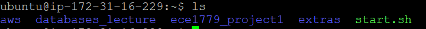
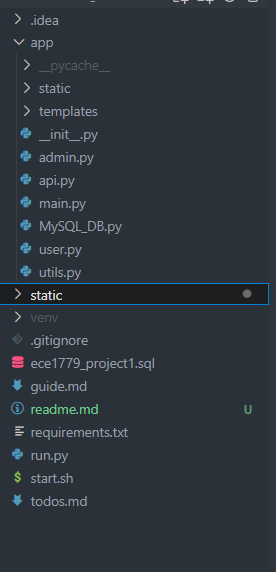
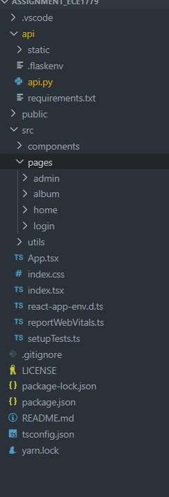
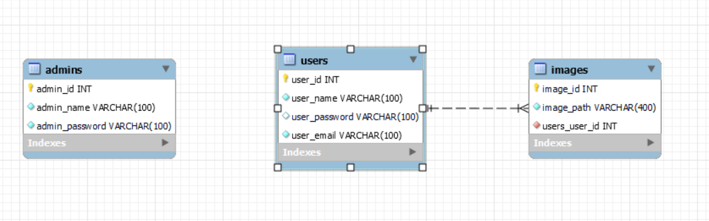
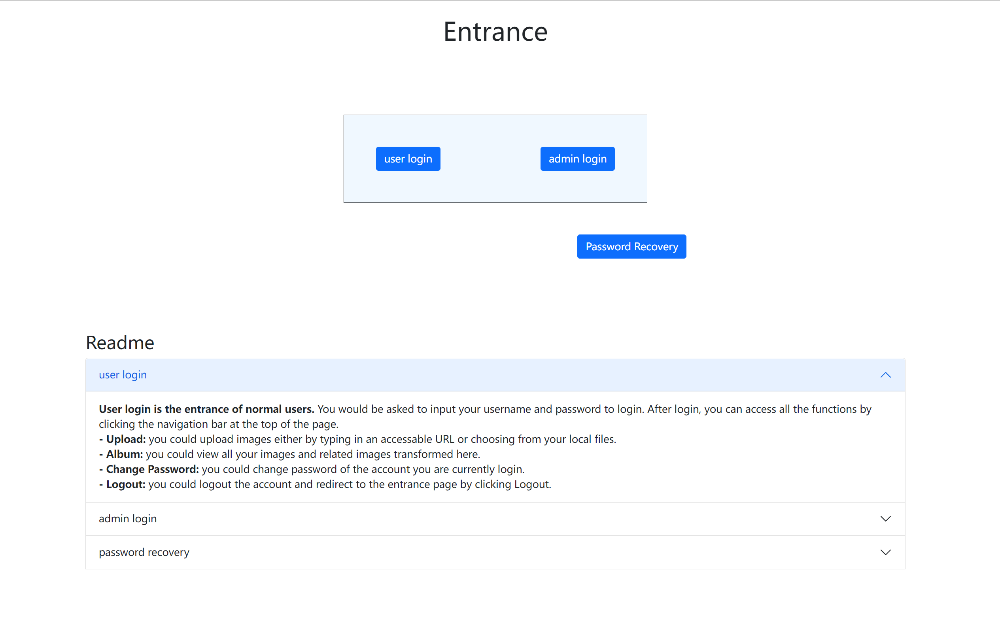
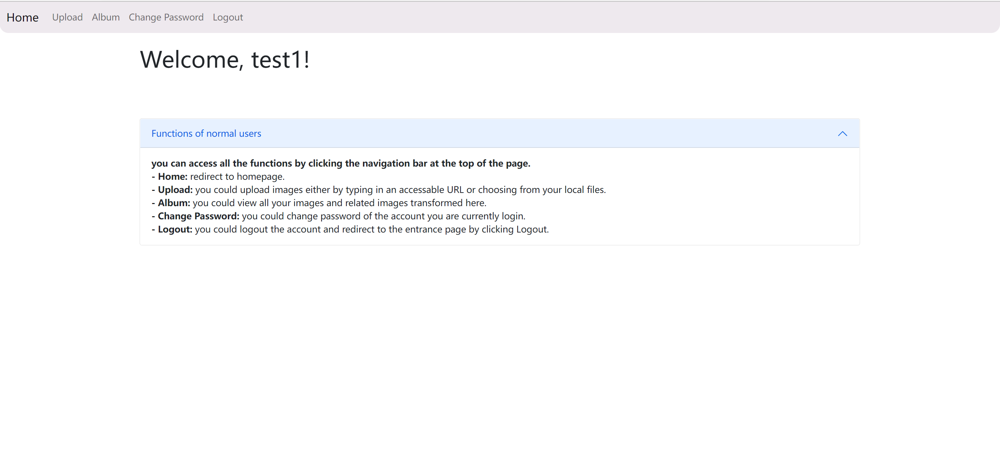
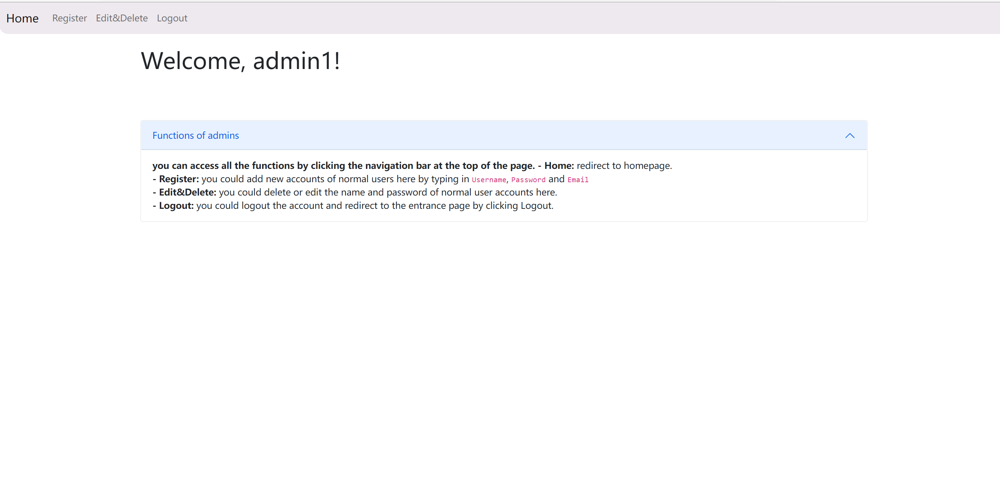
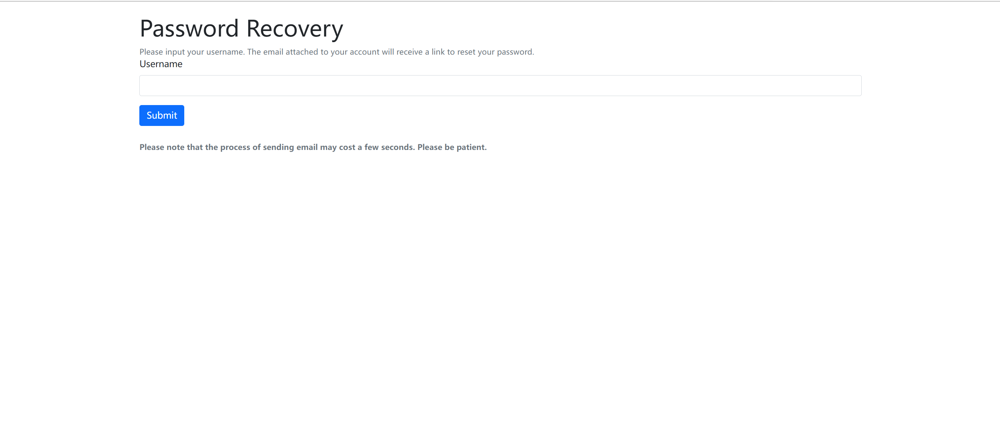

<h1 align="center">Documentation</h1>

----
- [Anouncement](#anouncement)
- [important information for test](#important-information-for-test)
- [Introduction - how to use the web application](#introduction)
  - [Start](#start) 
  - [user account needed for our application](#accounts)
  - [Architecture](#architecture)
  - [Database](#database)
- [User Tutorial - how to access each module of the application](#user-tutorial)
  - [Entrance](#entrance)
  - [Normal User](#normal-user)
  - [Admin](#admin)
  - [Password Recovery](#password-recovery)
- [Developer Tutorial](#developer-tutorial)
  - [Initialize Project](#initialize-project)
  - [Tech Stack](#tech-stack)

<br />

# Anouncement

In this document, we will explain the important parts of our application and introduce how to use it. We realize that even with this document, the testing affairs may still be hard. So, We also made a [video(click to watch)](https://www.bilibili.com/video/BV1944y1x7xn/) about our application and each page of it which goes into more details. If there is still anything unclear, please contact us at [lizhenqiao@mail.utoronto.ca](mailto:lizhenqiao@mail.utoronto.ca), we will respond as soon as possible. Or we could make an appointment to test our application as well.

We have accomplished all the functions required for the project, including hash the password, limit of the upload image, rename the image if have a repetition conflict, exception handling and so on. Considering that they are not complicated and can be mostly solved by using third-party libraries, this documentation will not go into details of the implementation of them. Besides, we will attach our code anyway.

<br />

# important information for test

- We made a [video(click to watch)](https://www.bilibili.com/video/BV1944y1x7xn/) about our application and each page of it which goes into more details. If there is still anything unclear, please contact us at [lizhenqiao@mail.utoronto.ca](mailto:lizhenqiao@mail.utoronto.ca), we will respond as soon as possible. Or we could make an appointment to test our application as well.
<br />
- credentials and .pem are uploaded in the folder.
<br />
- Quickstart of the application
At the **root path**, you are supposed to find a script called \"start\. sh\". This script will establish the virtual environment, prepare you with all the dependencies, and run on the server. Use the command below to run the project.

```
./start.sh 
```
</img>
<br />
- Accounts
Inorder to test the application, you might need some accounts for our application.

> Admin Accounts:  adminname: admin1, password: admin1
> User Accounts: username: test1, password: test1

You can register User account in the register section of admin page.
You can register new admin account by manipulating the TABLE #admins# in MySQL.

<br />
<br />


# Introduction
A web application for storing and browsing photographs. 

<br />

## Start
> This part basically explains how to run the project.

- ### Quickstart
  At the **root path**, you are supposed to find a script called \"start\. sh\". This script will establish the virtual environment, prepare you with all the dependencies, and run on the server. Use the command below to run the project.
  <br />
  ```
   ./start.sh 
   ```
  <br />
  
  </img>

<br />
<br />

## Accounts
user account needed for our application

Inorder to test the application, you might need some accounts for our application.

> Admin Accounts:  adminname: admin1, password: admin1
> User Accounts: username: test1, password: test1

You can register User account in the register section of admin page.
You can register new admin account by manipulating the TABLE #admins# in MySQL.

<br />
<br />

## Architecture


For web framework, we use `Flask` as our application.
Right now, we are using `template` for the UI part since it is relatively simple to accomplish. However, we have established a version2.0 application which uses `react.js` for our front-end application. In that way, our application could be more flexible and powerful. `flask` would be API layer, our front-end and back-end would be seperated in that way.  
Since most of our data are structured, we tend to use `MySQL` to store all our data to have a better performance and be easier to update.
<br />

### Version 1.0 (Current version)
<div style="display: flex; justify-content: flex-start">
  <div>
    </img>
  </div>
  <div style="margin-left: 30px; width: 400px">
    The architechture of our version1.0 project basically looks like this. We have a app folder which contains main content of our flask app. We divided this folder by the functions of each part as admin, user and so on. Except for app folder, we have several files related to version control and project co-working, and a file related to code-format-checking.
  </div>
</div>
<br />
<br />

### Version 2.0 (Developing version)
<div style="display: flex; justify-content: flex-start">
    <div>
      </img>
    </div>
    <div style="margin-left: 30px; width: 400px">
      We use react.js as front-end in this version because React.js could provide user with more friendly interaction, more beautiful UI, and more powerful functions. You could find more in the video we recorded.
    </div>
  </div>
  <br />
  <br />
  
  


## Database
Our database is based on MySQL which could deal with the syntactic reading and writing. By now we have three TABLEs in the DATABASE as the picture shows below. 
- *admins* stores the related information of admin users, mainly for login and verification of identity. 
- *users* stores the related message of normal users, it is important for the main functions of our application.
- *images* stores the user_id and image_path, which is the core of our image storage system.

</img>


# User Tutorial 
## Entrance
**Entrance page** is the first page you will see. There is a readme which explains the functions of the three part right in the webpage. 
</img>
- **User Login** <br />
<strong>User login is the entrance of normal users.</strong><br />
You would be asked to input your username and password to login.<br />
After login, you can access all the functions by clicking the navigation bar at the top of the page. <br />
<strong>- Upload:</strong> you could upload images either by typing in an accessable URL or choosing from your local files. <br />
<strong>- Album:</strong> you could view all your images and related images transformed here.<br />
<strong>- Change Password:</strong> you could change password of the account you are currently login. <br />
<strong>- Logout:</strong> you could logout the account and redirect to the entrance page by clicking Logout. <br />
<br />
- **Admin Login**<br />
<strong>Admin login is the entrance of admins.</strong><br />
You would be asked to input the username and password to login.<br />
After login, you can access all the functions by clicking the navigation bar at the top of the page. <br />
<strong>- Register:</strong> you could add new accounts of normal users here by typing in <code>Username</code>, <code>Password</code> and <code>Email</code><br />
<strong>- Edit&Delete:</strong> you could delete or edit the name and password of normal user accounts here. <br />
<strong>- Logout:</strong> you could logout the account and redirect to the entrance page by clicking Logout. <br />
<br />
- **Password Recovery**<br />
<strong>If you cannot recall your password, please click <code>PasswordRecovery</code></strong>
              You would be asked to input the username of your account. An email will be sent to the email address attached to your account for you to reset the password.


## normal user
After login as normal user, you would see the homepage of normal user shown as the picture below.

</img>

<strong>you can access all the functions by clicking the navigation bar at the top of the page.</strong><br />
<strong>- Home:</strong> redirect to homepage. <br />
<strong>- Upload:</strong> you could upload images either by typing in an accessable URL or choosing from your local files. <br />
<strong>- Album:</strong> you could view all your images and related images transformed here.<br /> 
<strong>- Change Password:</strong> you could change password of the account you are currently login. <br />
<strong>- Logout:</strong> you could logout the account and redirect to the entrance page by clicking Logout.<br />
<br />


## admin
After login as admin, you would see the homepage of admin shown as the picture below.

</img>

<strong>you can access all the functions by clicking the navigation bar at
the top of the page.</strong><br />
<strong>- Home:</strong> redirect to homepage.<br />
<strong>- Register:</strong> you could add new accounts of normal users here by typing in <code>Username</code>, <code>Password</code> and <code>Email</code><br />
<strong>- Edit&Delete:</strong> you could delete or edit the name and password of normal user accounts here.<br />
<strong>- Logout:</strong> you could logout the account and redirect to the entrance page by clicking Logout. <br />
<br />

## password recovery
<strong>If you cannot recall your password, please click <code>PasswordRecovery</code></strong>
You would be asked to input the username of your account. An email will be sent to the email address attached to your account for you to reset the password.
</img>


# Developer Tutorial
### Initialize Project.
  - #### Prepare  
    - Import dataset into your MySQL system. The simplest way of doing this is importing '/ece1779_project1.sql' .
    - Build your virtual environment for python.
        > python -m venv venv

      After create your own venv, you could activate it, your subsequent development should based on this virtual environment.
      > venv/Scripts/activate

      Please note that is for Windows, Macos have other command which is pretty similar.

    - Use the requirements.txt to download all dependencies in one time.
      > pip install -r requirements.txt

      One thing worth mentioning is that after each time you add some new dependencies. Before push your code to the repository. You should run the command below. This will update the dependencies in the requirement.txt
      > pip freeze > requirements.txt

    By now, you've got your development environment ready.

  - #### Run the code.
    Just type in the command below.
    
    > python run.py

### Tech Stack
**Version 1.0**
- python
- flask
- mysql

> You could see the details of all the dependencies at "requirements.txt"

